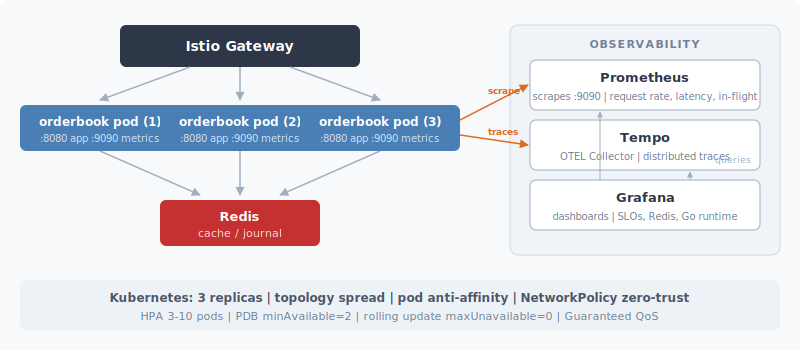
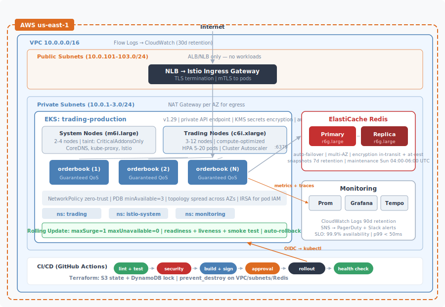

# Order Book Trading Service

A low-latency limit order book with price-time priority matching, built in Go. Containerized on distroless, orchestrated on Kubernetes with zero-downtime deploys, provisioned via Terraform, and observed through Prometheus/Grafana/OpenTelemetry.

---

## Assumptions

- **In-memory matching engine** with no write-ahead log. Production would add a WAL. See [Security Review, Risk 2](docs/security-review.md).
- **Single-region** targeting AWS us-east-1. Multi-region discussed in [Hybrid Migration](docs/hybrid-migration.md).
- **Redis is a cache and journal**, not the primary store. Best-effort persistence; the in-memory engine is the source of truth.
- **No API authentication.** Production would use Istio `RequestAuthentication` with JWT. See [Security Review, Risk 1](docs/security-review.md).
- **KinD for local, EKS for production.** Only the local KinD environment is runnable. Production Terraform is a design, not deployed.

## Architecture



| Component | File | Purpose |
|-----------|------|---------|
| Matching engine | `application/internal/orderbook/engine.go` | Price-time priority matching, partial fills, thread-safe per pair |
| HTTP handlers | `application/internal/handler/handler.go` | REST API: place, cancel, book snapshot, recent trades |
| Middleware | `application/internal/middleware/middleware.go` | RequestID, structured logging, Prometheus metrics, rate limiting, panic recovery |
| Health checks | `application/internal/health/` | `/healthz` (liveness), `/readyz` (readiness + Redis check) |
| Persistence | `application/internal/persistence/redis.go` | Event journal + order snapshots for crash recovery |
| Tracing | `application/internal/telemetry/tracing.go` | OpenTelemetry with configurable OTLP exporter |

## Quick Start

### Prerequisites

Docker (running), kind, kubectl, helm, opentofu (or terraform). On macOS:

```bash
make install-deps   # Installs kind, kubectl, helm, opentofu, hey via Homebrew
```

Other systems: `make deps-info` for manual install links. Go 1.24+ needed only for `make test` / `make lint`.

### From Scratch

```bash
git clone <repo> && cd book-trading
make install-deps   # macOS only
make up             # Build + KinD cluster + Istio + Redis + monitoring + deploy (~3-5 min)
make validate       # Correctness tests + load test
```

### Endpoints

| Endpoint | URL |
|----------|-----|
| API (NodePort) | http://127.0.0.1:8001 |
| Grafana | http://127.0.0.1:3000 (admin/admin) |
| API via Istio | `make pf` in another terminal, then http://localhost:8080 |

### Validate

```bash
make test           # Unit tests with race detector + coverage (requires Go 1.24+)
make validate       # E2E: health, ordering, matching, cancellation, input validation, load
make validate-istio # Same via Istio (run make pf first)
```

### Load Test

Requires `hey` (installed by `make install-deps`):

```bash
make pf             # Terminal 1: port-forward Istio ingress
make loadtest       # Terminal 2: 1000 POSTs, 50 concurrent
```

Results visible in Grafana at http://127.0.0.1:3000.

### Tear Down

```bash
make down
```

### Docker Compose (alternative, no Kubernetes)

```bash
docker compose up --build
```

API at http://localhost:8080, Grafana at http://localhost:3000.

## Production Design (Not Deployed)

The production Terraform (`infrastructure/terraform/environments/production/`) defines the target architecture but has **not been applied**. It demonstrates infrastructure design, module composition, and production-grade defaults. Only `make up` (KinD) is runnable.



The CI/CD pipelines are designed but not connected to a live AWS account. Infrastructure deploys first via Terraform, application second via kustomize with health verification and auto-rollback.

## Project Structure

```
application/                          # Go service
  cmd/orderbook/main.go               #   Entrypoint, config, graceful shutdown
  internal/{handler,orderbook,        #   HTTP handlers, matching engine,
    persistence,health,middleware,     #   Redis journal, probes, metrics,
    telemetry}/                       #   OpenTelemetry tracing
  tests/                              #   Integration tests (miniredis)
infrastructure/
  deploy/kubernetes/
    base/                             #   Deployment, Service, HPA, PDB, NetworkPolicy, Istio
    overlays/{local,production}/      #   Environment patches
    monitoring/local/                 #   Prometheus, Grafana, dashboards
  terraform/
    environments/{local,production}/  #   KinD (local), VPC+EKS+ElastiCache (prod)
    modules/{vpc,eks,redis,monitoring}/
  scripts/validate.sh                 #   E2E correctness + load validation
.github/workflows/
  ci-application.yml                  #   Lint, test, security, build, rollout
  ci-infrastructure.yml               #   Security scan, Terraform plan/apply
  actions/{lint,build,security,       #   Reusable composite actions
    infra-security,deploy,rollout}/
docs/                                 #   Design documents (see below)
```

## Documentation

| Document | Section | Covers |
|----------|---------|--------|
| [CI/CD and Production Safety](docs/cicd.md) | 4 | Security gates, deploy safety, rollback, secrets |
| [Observability](docs/observability.md) | 5 | SLOs, alerting, incident debugging walkthrough |
| [Hybrid Migration](docs/hybrid-migration.md) | 6 | Phased on-prem to cloud migration |
| [Security Review](docs/security-review.md) | 7 | Threat model (STRIDE), five risks, hardening priorities |

Design decisions for Sections 1-3 are documented inline in the Kubernetes manifests, Terraform modules, and Dockerfile comments.
