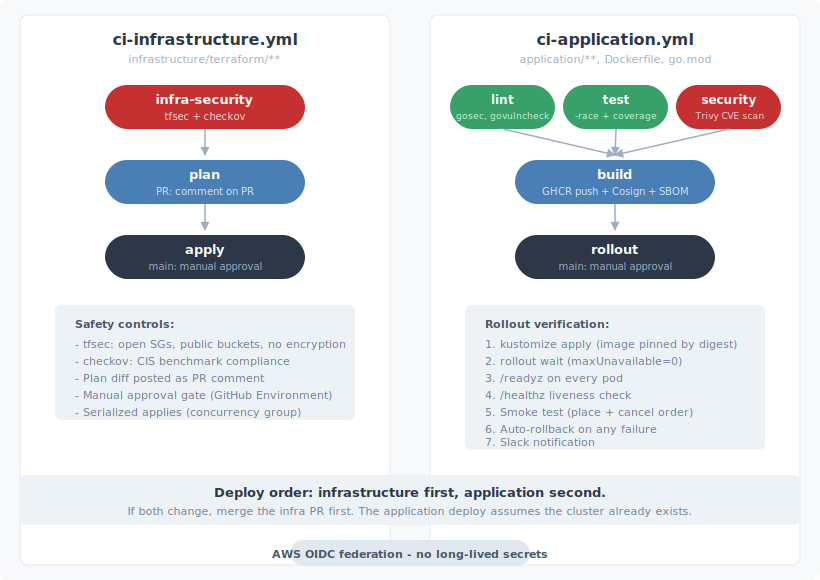
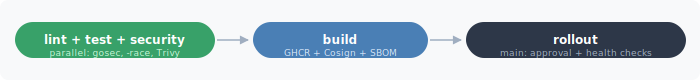
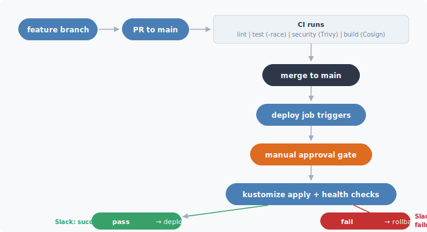
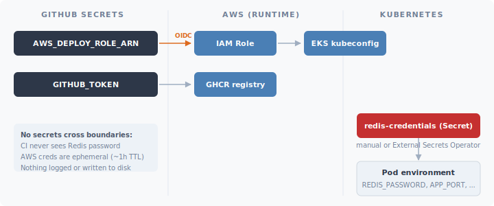

# CI/CD and Production Safety

How the order book service is built, validated, and deployed to production with automated safety controls.

---

## Pipeline Architecture

Two independent workflows, separated by concern:



**Infrastructure first, application second.** If both change, merge the infra PR first. The application deploy assumes the cluster already exists.

### ci-infrastructure.yml

Triggered by changes to `infrastructure/terraform/**`. Manages VPC, EKS, ElastiCache, monitoring.


### ci-application.yml

Triggered by changes to `application/**`, `Dockerfile`, `go.mod`. Builds and deploys the orderbook service.



---

## Reusable Actions

All CI/CD logic is extracted into composite actions under `.github/workflows/actions/`:

| Action | Purpose |
|--------|---------|
| `lint` | gofmt, go vet, golangci-lint, gosec (SAST), govulncheck |
| `build` | Docker BuildKit, multi-arch, tag generation, Cosign signing, SBOM, provenance |
| `security` | Trivy container vulnerability scanning with SARIF upload |
| `infra-security` | tfsec (Terraform misconfigs), checkov (CIS benchmarks), conftest (custom OPA policies) |
| `deploy` | Terraform fmt, init, validate, plan, apply with AWS OIDC federation |
| `rollout` | Kustomize apply, rollout wait, readiness, liveness, smoke test, rollback, Slack notify |

---

## Security Gates

Every change passes through multiple security layers before reaching production:

### Application Code

| Scanner | What It Catches | Stage |
|---------|----------------|-------|
| gosec | SAST: hardcoded credentials, SQL injection patterns, weak crypto | `lint` job |
| govulncheck | Known vulnerabilities in Go dependencies | `lint` job |
| Trivy | CVEs in the container image (OS packages, Go binary) | `security` job |
| Cosign | Image signing — tamper detection after build | `build` job |
| SBOM (SPDX) | Software Bill of Materials — full inventory of packages and dependencies in the image, attached as a registry attestation. Enables post-build vulnerability scanning and audit trail for compliance. | `build` job |
| SLSA Provenance | Attestation of how and where the image was built (source repo, commit, builder identity). Establishes a verifiable chain from source to artifact. | `build` job |

### Infrastructure Code

| Scanner | What It Catches | Blocking |
|---------|----------------|----------|
| tfsec | Open security groups, public S3 buckets, disabled encryption, overly permissive IAM | Yes |
| checkov | CIS benchmark compliance for AWS resources | No (advisory) |
| conftest | Custom OPA/Rego policy rules (optional, via policy directory) | Yes, if configured |

These run statically against the HCL files — no cloud credentials needed. Security issues are caught during code review, not after the infrastructure is live.

---

## Deployment Safety

### How a Deploy Works

1. **Image pinning** — kustomize overlay is patched with the exact image digest (`sha256:...`) from the build step. Tags are mutable; digests are not.

2. **Server-side apply** — `kubectl apply --server-side --field-manager=ci-deploy` tracks which fields are owned by CI vs manual changes. Prevents accidental overwrites.

3. **Rolling update** — the Deployment uses `maxSurge=1, maxUnavailable=0`. Kubernetes creates one new pod, waits for it to pass readiness, then terminates one old pod. No requests hit a terminating pod.

4. **Readiness verification** — after the rollout completes, the pipeline port-forwards to every pod and hits `/readyz`. This endpoint checks Redis connectivity and application state. If any pod fails, the deploy is rolled back.

5. **Liveness verification** — hits `/healthz` to confirm the process is alive (not just ready).

6. **Smoke test** — places a real order (`POST /api/v1/orders`) and cancels it. This validates the full request path: JSON parsing, input validation, matching engine, Redis persistence, cache invalidation, response serialization.

7. **Automatic rollback** — if any step (3-6) fails, `kubectl rollout undo` restores the previous revision. The on-call engineer is notified via Slack.

### What Prevents Bad Deploys

| Control | How It Works |
|---------|-------------|
| Manual approval gate | GitHub Environment `production` requires reviewer approval before the deploy job runs |
| Serialized deploys | Concurrency group `deploy-production` — a second deploy queues, never runs in parallel |
| Cancel stale CI | New PR push cancels in-progress CI for that branch — no wasted runners |
| Credential isolation | AWS OIDC federation — no long-lived access keys in GitHub Secrets |
| Revision history | `revisionHistoryLimit: 5` in the Deployment — rollback to any of the last 5 revisions |
| `minReadySeconds: 10` | New pods must stay healthy for 10 seconds before the rollout progresses |

### Rollback

Rollback is automatic on verification failure. For manual rollback:

```bash
# Roll back to the previous revision
kubectl rollout undo deployment/orderbook -n trading

# Roll back to a specific revision
kubectl rollout undo deployment/orderbook -n trading --to-revision=3

# Check rollout history
kubectl rollout history deployment/orderbook -n trading
```

---

## Branching and Promotion Model



- **Trunk-based development**: short-lived feature branches, merge to main.
- **No staging environment in this implementation**: production is gated by the approval step and post-deploy verification. A staging environment would be added by creating `infrastructure/terraform/environments/staging/` and a second deploy job targeting it (the Terraform modules and kustomize overlays are already parameterized for this).
- **No long-lived develop/release branches**: the `develop` branch in the CI trigger exists for teams that use it, but the deploy job only runs on `main`.

---

## Secrets Flow



- CI never sees the Redis password — it is injected into pods via Kubernetes Secrets.
- AWS credentials are ephemeral (OIDC session tokens, ~1 hour TTL).
- No secrets are logged, echoed, or written to disk during CI.

---

## What Happens If a Deploy Partially Succeeds

The rolling update strategy means partial success is visible as a mixed-revision deployment:

- Some pods run the new version (passed readiness), some still run the old version.
- If the pipeline fails at the health check step, `kubectl rollout undo` reverts all pods to the previous revision.
- If the pipeline runner crashes mid-deploy (GitHub Actions outage), Kubernetes continues the rollout independently. The next CI run will detect the state via `kubectl rollout status` and either verify or roll back.
- The `minReadySeconds: 10` window ensures that a pod that crashes immediately after becoming ready (e.g., a startup race condition) is caught before the rollout progresses.
