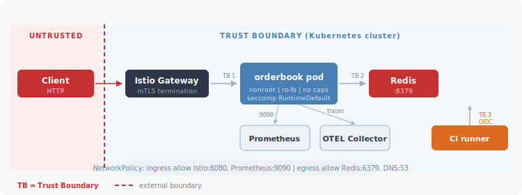

# Security Self-Review

An honest look at what's secure, what's not, and what I'd fix first.

---

## Threat Model

The order book service accepts untrusted HTTP from external clients, matches orders in memory, and persists events to Redis. It runs on Kubernetes behind Istio.

**Trust boundaries:**
1. Istio gateway → orderbook pod (external traffic enters the mesh)
2. orderbook pod → Redis (application talks to its data store)

**Assets worth protecting:**

| Asset | Why it matters |
|-------|---------------|
| Open orders (bids/asks) | Manipulation affects market pricing |
| Trade history | Regulatory audit trail |
| Order book snapshots | Reveals market depth to competitors |
| Redis credentials | Grants access to journal and cache |
| Container images | Tampered image = full compromise |

**Who might attack this:**

| Actor | What they'd try |
|-------|----------------|
| External attacker | Manipulate orders, exfiltrate book data, deny service |
| Compromised CI runner | Supply chain attack — deploy malicious image |
| Insider | Modify orders, exfiltrate data, misconfigure infra |
| Adjacent pod (compromised neighbor) | Lateral movement to orderbook or Redis |

### STRIDE

| Threat | Vector | Mitigation | Gap |
|--------|--------|-----------|-----|
| **Spoofing** | No identity on API requests | NetworkPolicy restricts to Istio gateway only | No authentication (Risk 1) |
| **Tampering** | Malicious container image pushed to registry | CI supports Cosign signing, SBOM, Trivy scanning | Signing not enforced, no admission controller (Risk 4) |
| **Repudiation** | Modify Redis journal entries after trades | Journal uses append pattern (LPUSH + LTRIM) | Mutable — anyone with Redis access can edit entries |
| **Info Disclosure** | Read full order book via unauthenticated GET | Rate limiting per IP | No auth means anyone can read market depth |
| **DoS** | Flood orders to exhaust memory | Per-IP rate limit, HPA, PDB | Rate limit is per-pod, bypassed with N replicas (Risk 5) |
| **Elevation** | Container escape → host | Nonroot, ro-fs, drop ALL caps, seccomp | Strong — next step would be AppArmor |

---

## Five Risks

### 1. No Authentication (Critical)

Every endpoint is open. Anyone with network access can place orders, cancel orders, read the full book. In a real exchange this enables spoofing/layering — place fake orders to move the visible book, cancel before execution, no identity recorded.

The NetworkPolicy helps (only Istio gateway traffic reaches the pod), and UUIDs for order IDs aren't guessable, but these are speed bumps, not access control.

The fix is Istio-native: `RequestAuthentication` + `AuthorizationPolicy` at the gateway. No application code changes. The app never needs to parse tokens — the sidecar handles it.

### 2. In-Memory State, No WAL (High)

All order state lives in memory. Pod dies, orders are gone. The Redis journal exists but it's best-effort (fire-and-forget writes) and recovery is disabled in multi-replica mode to avoid duplicate orders.

This is less of a security risk and more of an availability one, but an attacker who can trigger OOMKill (e.g., via large payloads if validation is insufficient) effectively wipes the order book. More realistically, a node failure during trading hours loses all open orders.

Production fix: Redis Streams with acknowledgment before responding to the client. For multi-replica, leader election via Kubernetes lease with followers replaying the stream.

### 3. Secrets Management (High)

Three problems here. `docker-compose.yml` has `REDIS_PASSWORD=compose-local-dev-only` in plaintext — it's labeled as dev-only but it's in version control. Kubernetes secrets are created manually with no rotation or audit trail. And the commented CI deploy job originally referenced long-lived Azure credentials (now fixed to AWS OIDC, but it shows how easy it is to end up with static secrets).

The Kubernetes side is the more serious concern. Anyone with `kubectl get secret` in the trading namespace can decode the Redis password. External Secrets Operator pulling from AWS Secrets Manager would fix both the lifecycle and the access control problem.

### 4. Unsigned Container Images (Medium)

The CI pipeline has Cosign signing and SBOM generation built in, but signing is optional (the `cosign-key` input isn't configured) and there's no admission controller rejecting unsigned images. So the capability exists but isn't enforced — which in practice means it doesn't exist.

An attacker who compromises the registry or CI pipeline can push a malicious image. The deploy pipeline pins by digest (not tag), which prevents tag mutation attacks, and Trivy catches known CVEs. But there's no cryptographic proof that the running image is what CI built.

Lowest-effort fix of all five risks: configure the Cosign key pair in GitHub Secrets and deploy Sigstore policy-controller. Maybe two days of work.

### 5. Per-Pod Rate Limiter (Medium)

The rate limiter in `middleware.go` uses an in-memory map keyed on `RemoteAddr`. Two problems: with 3 replicas, an attacker gets 3x the intended rate. And in Kubernetes, `RemoteAddr` is the Istio sidecar IP, not the client — so either all traffic shares one bucket or the limit doesn't apply at all depending on the network path.

The per-pod limiter still has value as defense in depth (catches bursts even if the mesh limiter misconfigures), but the primary rate limit should be at the Istio gateway level using EnvoyFilter + a Redis-backed rate limit service.

---

## What's Already Solid

Not everything is a gap. The runtime hardening is genuine:

- **Distroless image.** No shell, no package manager. Code execution inside the container gives you nothing to work with.
- **Read-only filesystem + drop ALL capabilities + seccomp RuntimeDefault.** The full hardening stack, not cherry-picked.
- **NetworkPolicy deny-all with explicit allowlist.** Istio on 8080, Prometheus on 9090, Redis on 6379, DNS on 53. Nothing else.
- **Graceful degradation.** Redis goes down, the service keeps matching orders. No cascade.
- **Input validation.** Handler rejects negative prices, zero quantities, invalid sides before they reach the engine.

On the CI/CD side:
- **tfsec + checkov** scan Terraform before plan/apply. Catches open security groups and disabled encryption during code review.
- **gosec + govulncheck** for application SAST and dependency vulnerabilities.
- **Trivy** scans the built container image for CVEs.
- **SBOM (SPDX) + SLSA provenance** attached to every image as registry attestations.
- **AWS OIDC** for CI/CD. No long-lived credentials in GitHub Secrets.

## Compliance Gaps

| Concern | State | Gap |
|---------|-------|-----|
| Audit trail | Redis journal captures events | Not tamper-proof. Production: append-only log with separate permissions. |
| Data retention | Journal capped at 10k entries | Financial regs typically require 5-7 years. |
| Encryption in transit | Istio mTLS + ElastiCache transit encryption | Local dev runs without TLS. Acceptable but should be documented for auditors. |
| Vulnerability mgmt | Trivy, gosec, govulncheck, tfsec, checkov | No runtime scanning (Falco). |

## What I'd Harden First

In order of effort-to-impact:

1. **Enforce image signing** (Risk 4). Configure Cosign key, deploy admission controller. Lowest effort, closes the supply chain gap without touching application code.
2. **Add API authentication** (Risk 1). Istio `RequestAuthentication` + `AuthorizationPolicy`. No app changes. Blocks all unauthenticated access.
3. **Automate secrets** (Risk 3). External Secrets Operator from AWS Secrets Manager. Eliminates manual kubectl and plaintext compose passwords.
4. **Distributed rate limiting** (Risk 5). Istio EnvoyFilter + Redis rate limit service. Fixes per-pod bypass and the RemoteAddr issue together.
5. **WAL** (Risk 2). Redis Streams with ack before response. Largest change, requires application architecture work.
